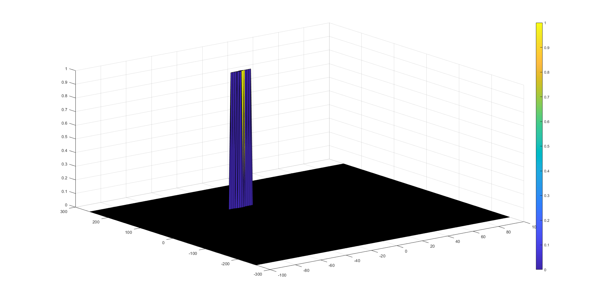
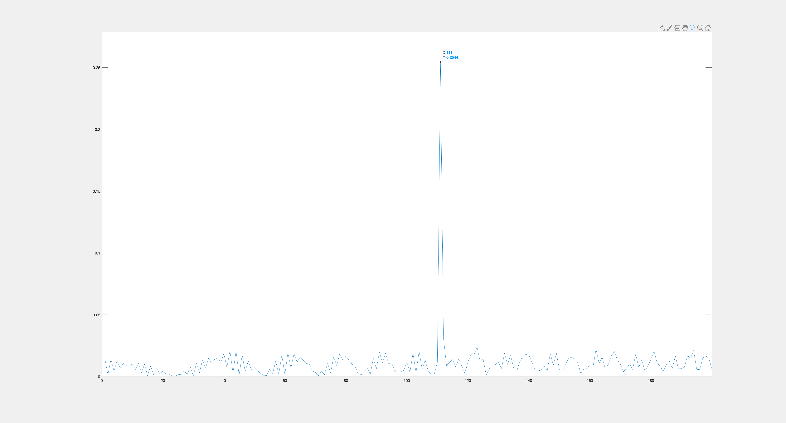
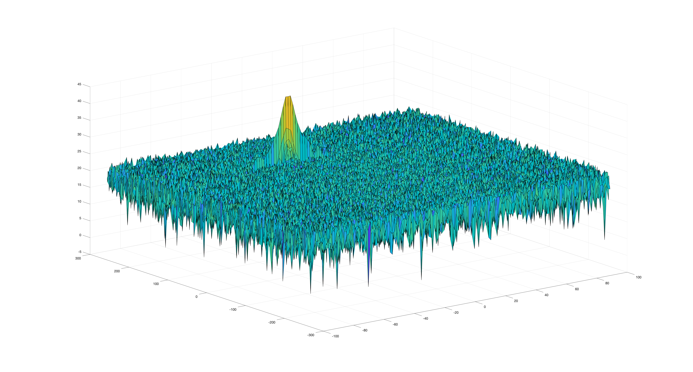
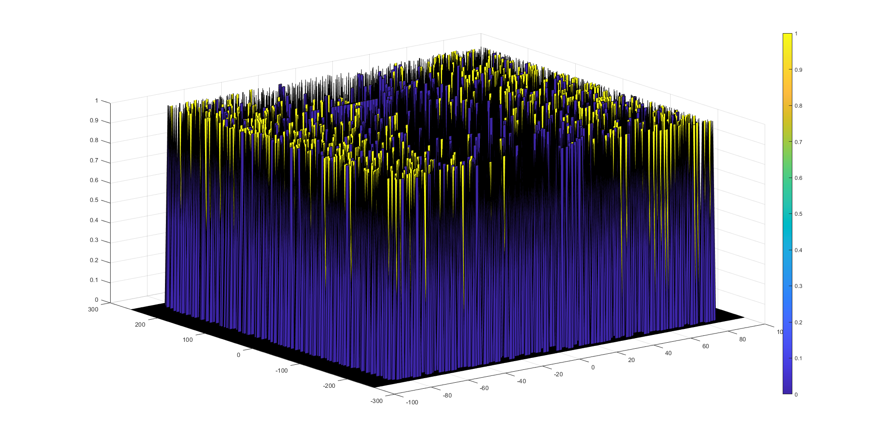
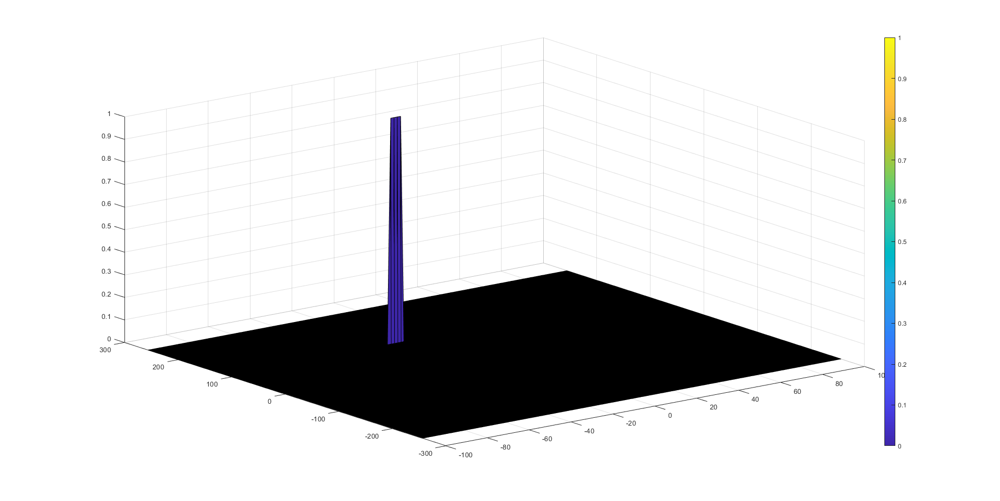
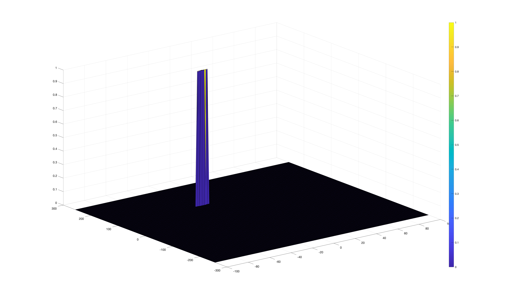
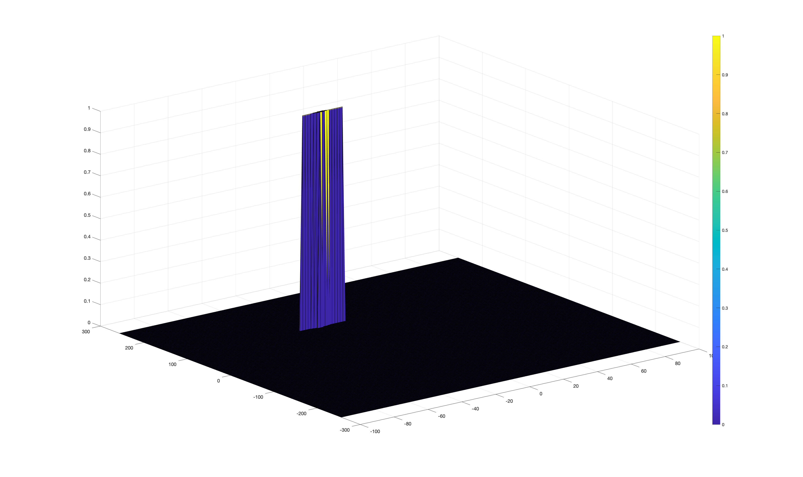
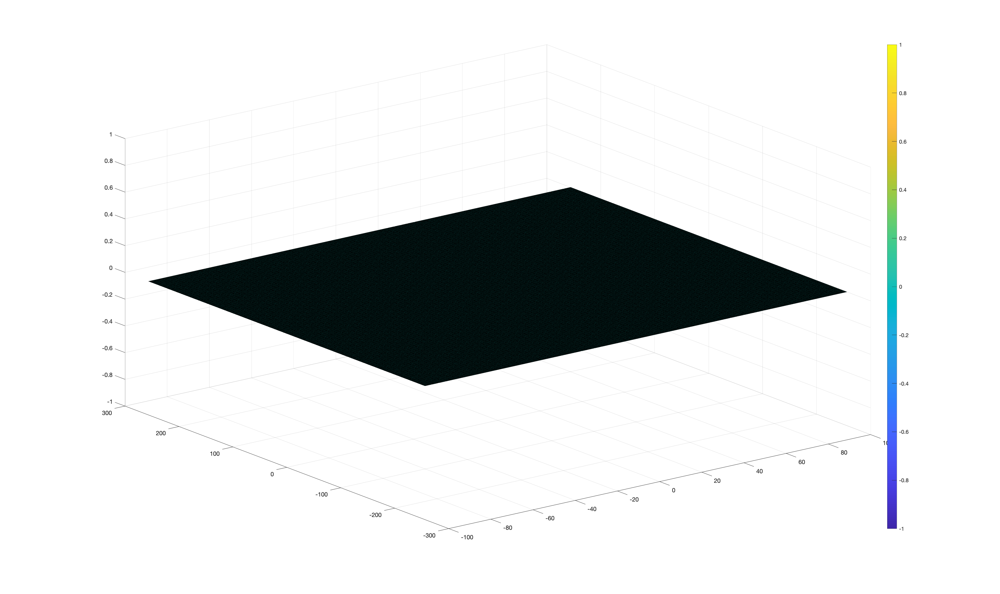
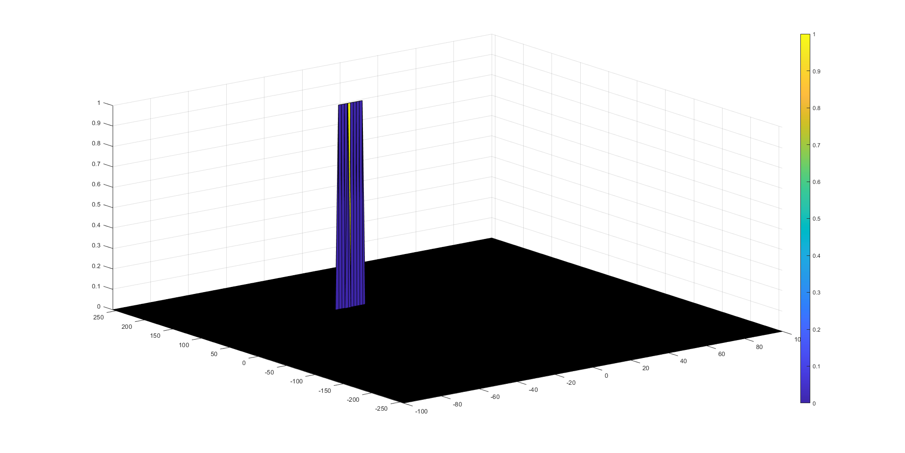

# SFND Radar Generation and Detection (using MATLAB)

The objective of the project is to design, simulate and evaluate radar signal generation and detection. The scipt is written in MATLAB m-scripts.

## Target Generation and Detection


## Dependencies for Running Locally

- MATLAB R2017a or later. Tested with MATLAB R2019b
- Automated Driving Toolbox for MATLAB

## MATLAB Download
To complete the project, you will need to download MATLAB on your computer, if you haven't already. To get started, you can follow these steps:

1. If you do not already have a MathWorks account, create one [here](https://www.mathworks.com/mwaccount/register). Be sure to verify your email (check your Junk/Spam folders) before moving on to step 2.
2. Download the installer [here](https://www.mathworks.com/licensecenter/classroom/udacity_sf_radar/).
3. Run the installer – it will guide you through the steps for your OS.

## FMCW waveforms specification

| Specification       | Values |
|---------------------|--------|
| Frequency           | 77 Ghz |
| Range Resolution    | 1m     |
| Max Range           | 200 m  |
| Max Velocity        | 70 m/s |
| Velocity resolution | 3 m/s  |

## 2D-CFAR

Here is the preview of the final result of applying 2D-CFAR (<ins>__C__</ins>onstant <ins>__F__</ins>alse <ins>__A__</ins>larm <ins>__R__</ins>ate) processing to suppress the noise and separate
the target signal, which had the initial range of 110 meters and -20 m/s of velocity (i.e. receeding object).



| 2D-CFAR Parameters                   | Number of Cells |
|--------------------------------------|:---------------:|
| Number of Training cells for range   |        7        |
| Number of Training cells for doppler |        7        |
| Number of Guard cells for range      |        2        |
| Number of Guard cells for doppler    |        2        |
| Threshold Factor (Offset)            |        5        |

### Implementation steps for the 2D CFAR process.

1. Configure the FMCW waveform based on the system requirements.
2. Define the range and velocity of target and simulate its displacement.
3. For the same simulation loop process the transmit and receive signal to determine the beat signal
4. Perform Range FFT on the received signal to determine the Range
5. Towards the end, perform the CFAR processing on the output of 2nd FFT to display the target.

#### 1. FMCW waveform configuration

Using the above given system requirements, FMCW waveform's design should have the following characeristics:

- Bandwidth, `B`
- chirp time, `Tchirp`
- Slope of the chirp, `Slope`

```m
%% FMCW Waveform Generation

% Design the FMCW waveform by giving the specs of each of its parameters.
% Calculate the Bandwidth (B), Chirp Time (Tchirp) and Slope (slope) of the 
% FMCW chirp using the requirements above.

% Bandwith for each chirp for a given resolution
c = 3e8;    % speed of light [m/s]
d_res = 1;  % range resolution [m]
B = c/(2*d_res);

R_max = 200;    % maximum range [m]
% Sweep time for each chirp is defined with the rule by 5.5 times of round
% trip time for Maximum Range
Tchirp = 5.5*2*(R_max)/c;
slope = B / Tchirp;
```

MATLAB results:
```m
>> slope

slope =

   2.0455e+13
```

#### 2. Define range and velocity of the target

```m
%% User Defined Range and Velocity of target
% define the target's initial position and velocity. 
% Note : Velocity remains contant

R = 110;     % target's initial position [m]
v = -20;     % target's initial velocity [m/s], 
             % negative value mean receeding target
             % positive value mean approaching target
```

#### 3. Determine the beat signal based on the simulated transmit and receive signal

To simulate signal propagation for moving target scenario, The beat signal is calculated by multiplying the Transmit signal with Receive signal. This process in turn works as frequency subtraction. It is implemented by element by element multiplication of transmit and receive signal matrices.

```m
%% Signal generation and Moving Target simulation
% Running the radar scenario over the time. 

% Initial target range position
for i=1:length(t)
    % For each time stamp update the Range of the Target 
    % for constant velocity. 
    r_t(i) = R + v*t(i);
    % delayed time
    td(i) = (2*r_t(i))/c;
    
    % For each time sample we need update the transmitted
    % and received signal. 
    Tx(i)   = cos(2*pi*(fc*t(i)+ (slope*t(i)^2)/2));
    Rx(i)   = cos(2*pi*(fc*(t(i)-td(i))+ (slope*(t(i)-td(i))^2)/2));
end

% Now by mixing the Transmit and Receive generate the beat signal
% This is done by element wise matrix multiplication of Transmit and
% Receiver Signal
Mix = Tx.*Rx;
```

#### 4. Perform Range FFT on the received signal to determine the Range

From the above image, we can see that the generated beat (`Mix`) signal based on simulated transmit (`Tx`) and received (`Rx`) signals is 111 meters, which is well within the requirements of error margain of +/- 10 meters for the initial position of target (`R`) which is 110 meters.

#### Range FFT (1st FFT)



```m
%% RANGE MEASUREMENT

% reshape the vector into Nr*Nd array. Nr and Nd here would also define 
% the size of Range and Doppler FFT respectively.
Mix = reshape(Mix,[Nr,Nd]);

% run the FFT on the beat signal along the range bins dimension (Nr) 
% and normalize.
Y = fft(Mix,[],1); % Y = fft(Mix,Nr);
P = Y./Nr;

% Take the absolute value of FFT output
P2 = abs(P);

% Output of FFT is double sided signal, but we are interested in only one side of the spectrum.
% Hence we throw out half of the samples.
P1 = P2(1:Nr/2+1);

% Plot FFT output 
figure ('Name','Range from First FFT');plot(P1) 
% Plotting the range
axis ([0 200 0 0.5]);
```

#### Doppler FFT (2nd FFT)



```m
%% RANGE DOPPLER RESPONSE
% The 2D FFT implementation is already provided here. This will run a 2DFFT
% on the mixed signal (beat signal) output and generate a range doppler
% map.You will implement CFAR on the generated RDM

% Range Doppler Map Generation.

% The output of the 2D FFT is an image that has reponse in the range and
% doppler FFT bins. So, it is important to convert the axis from bin sizes
% to range and doppler based on their Max values.

Mix = reshape(Mix,[Nr,Nd]);

% 2D FFT using the FFT size for both dimensions.
sig_fft2 = fft2(Mix,Nr,Nd);

% Taking just one side of signal from Range dimension.
sig_fft2 = sig_fft2(1:Nr/2,1:Nd);
sig_fft2 = fftshift (sig_fft2);
RDM = abs(sig_fft2);
RDM = 10*log10(RDM) ;

% use the surf function to plot the output of 2DFFT and to show axis in both
% dimensions
doppler_axis = linspace(-100,100,Nd);
range_axis = linspace(-200,200,Nr/2)*((Nr/2)/400);
figure('Name','2D FFT output - Range Doppler Map'),surf(doppler_axis,range_axis,RDM);
```

#### Selection of Training, Guard cells and offset

In order to effectively reduce the false positive alarm for the target using 2D-CFAR, a dynamic threshold of calculating the target signal is defined using a combination of training and guard cells and offset.


The parmeters selections process were carried out in the following order:

1. Offset: The offset is used to separate the noise level by __SNR__ (signal to noise) value in __dB__. This parameter is tuned first because without approriate values selection, it will either:

- unable to separate the isolate target signals when offset is set too small (i.e. offset < 5), or
- excessively suppress the actual target signal

| Scenario | Offset | Results                                               |
|----------|:------:|-------------------------------------------------------|
| __Ideal__|    5   |   |
| Too Low  |    2   |   |
| Too High |   15   |  |

2. Training cells:

The number of training cells should be decided based on the environment. _If a dense traffic scenario then the fewer training cells should be used_, as closely spaced targets can impact the noise estimate.

Once the offset values have been defined (i.e. offset = 5), approriate training cells need to be set in order to have a confident estimation of locating the radar detected target. Through experimentation, the ideal number of training cells for the range and doppler are around 7.

The parameter is more sensitive when the number of training cells is too low, as shown below only a small section of the radar spectrum is shortlisted, which could may potentially leads to missing the actual target. On the other hand, if the number of training cells are too high (i.e. 100), the CFAR will also fail due to inability to separate the noise and the actual target signal.

| Scenario | Training Cells | Results                                                  |
|----------|:--------------:|----------------------------------------------------------|
| __Ideal__|        7       |      |
| Too Low  |        2       |      |
| Too High |       20       |    |
| Too High |      100       |  |

3. Guard cells

The number of guard cells should be decided based on the _leakage of the target signal out of the cell under test_. If target reflections are strong they often get into surrounding bins.

After SNR offset values and number of training cells are defined, the number guard cells in this project are selected to allow two bins for the detected target. If the number of guard cells are too low, then only very little to no bins (highlighted in yellow) can be used to locate the target. Conversely if the number of guard cells are too high, it could lead to leaking surrounding bins like the example show that guard cells are set to 4.

| Scenario | Guard cells | Results                                               |
|----------|:-----------:|-------------------------------------------------------|
| __Ideal__|      2      |   |
| Too Low  |      0      |   |
| Too High |      4      |   |